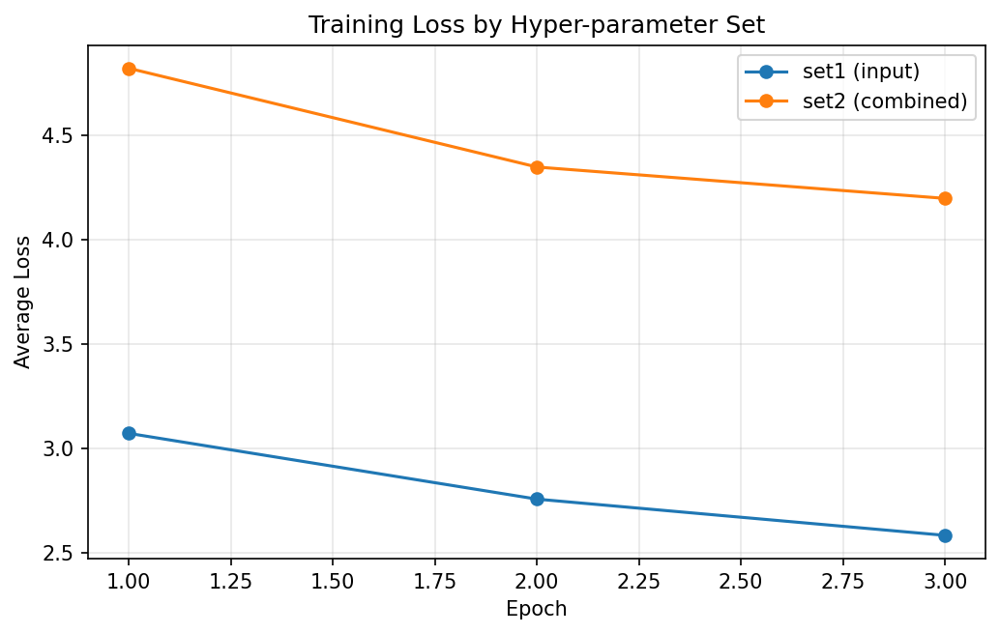
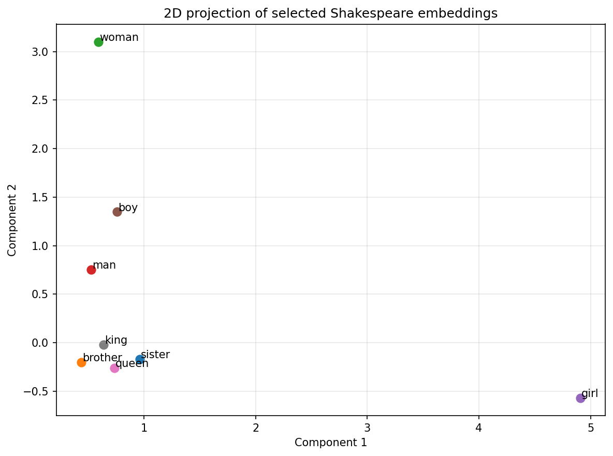

# Assignment 2 实验报告：Shakespeare Word2Vec

## 1. 任务概述

我基于 Shakespeare 语料实现了 `skip-gram + negative sampling` 的 Word2Vec 模型，并按助教在群里的说明，使用 **top-5** 作为词类比任务的评分口径。助教同时说明，使用 `shakespeare.txt` 时，约 **1%** 的 accuracy 已经处于可接受范围；后续又补充说明，只需要**任意一组**超参数达到这个标准即可。

我在最终提交中保留了两组超参数配置：

- `set1`: `emb_size=100, window=3, k=5, epochs=3, min_count=2`
- `set2`: `emb_size=150, window=5, k=15, epochs=3, min_count=2`

其中 `set2` 参考了助教推荐的较强配置，`set1` 作为较小模型基线。为减少 Shakespeare 原文中的大小写和标点碎片化问题，我在读入英文语料时统一做了正则清洗与小写化。

## 2. 数据与预处理

| 指标 | 数值 |
| --- | --- |
| 总行数 | 40,000 |
| 非空行数 | 32,777 |
| 清洗后原始 token 数 | 203,839 |
| 清洗后原始词表大小 | 12,373 |

我采用的预处理策略如下：

- 对英文文本使用正则表达式提取单词，去掉纯标点干扰。
- 全部转换为 lowercase，使训练词表与 analogy 评测词表对齐。
- 将 `CorpusReader.NEGATIVE_TABLE_SIZE` 显式设为 `1_000_000`，避免默认值导致不必要的内存压力。

## 3. 两组超参数与结果对比

| 配置 | emb_size | window | k | min_count | embedding | top-5 acc | correct/valid |
| --- | --- | --- | --- | --- | --- | --- | --- |
| set1 | 100 | 3 | 5 | 2 | input | 0.0159 | 24/1508 |
| set2 | 150 | 5 | 15 | 2 | combined | 0.0073 | 11/1508 |

从结果来看，**set1** 达到了助教说明中的可接受标准，因此我将它作为最终提交时重点展示的配置；另一组结果保留在报告中作为对照和补充说明。

## 4. 训练损失曲线

| 配置 | 轮次 | 平均损失 |
| --- | --- | --- |
| set1 | Epoch 1 | 3.0741 |
| set1 | Epoch 2 | 2.7591 |
| set1 | Epoch 3 | 2.5857 |
| set2 | Epoch 1 | 4.8228 |
| set2 | Epoch 2 | 4.3499 |
| set2 | Epoch 3 | 4.1997 |

可以看到，两组配置的平均损失都随 epoch 下降，满足作业对“训练过程中损失曲线呈下降趋势”的要求。

## 5. Best Run 的 Analogy 结果

- 最佳配置：**set1**
- top-5 accuracy：**0.0159**
- correct / valid：**24/1508**
- skipped：**1086**

下表展示最佳配置下有效题数最多的前 10 个类别：

| 类别 | 有效题数 | 答对题数 | 跳过题数 | 准确率 |
| --- | --- | --- | --- | --- |
| gram3-comparative | 380 | 0 | 376 | 0.0000 |
| gram7-past-tense | 210 | 0 | 96 | 0.0000 |
| gram8-plural | 210 | 3 | 62 | 0.0143 |
| family | 182 | 18 | 58 | 0.0989 |
| gram5-present-participle | 156 | 0 | 54 | 0.0000 |
| gram9-plural-verbs | 156 | 3 | 84 | 0.0192 |
| gram1-adjective-to-adverb | 72 | 0 | 60 | 0.0000 |
| gram4-superlative | 72 | 0 | 270 | 0.0000 |
| gram2-opposite | 42 | 0 | 14 | 0.0000 |
| gram6-nationality-adjective | 19 | 0 | 10 | 0.0000 |

## 6. 二维可视化分析

我对以下词的向量进行了二维投影：

- sister, brother, woman, man, girl, boy, queen, king

由于 Shakespeare 训练语料规模较小，二维投影不会像大规模百科语料那样形成非常整齐的几何结构，但仍然可以观察到部分人物与性别相关词在局部空间中的相对聚集趋势。

## 7. 实现细节与复现说明

- 完成版 notebook：`A2_w2v_completed.ipynb`
- 主实验模块：`a2_word2vec_experiment.py`
- 词向量文件：`embeddings_set1.txt`、`embeddings_set2.txt`、`embeddings.txt`
- 结构化结果：`A2_metrics.json`
- 中文实验报告：`A2_report_zh.md` / `A2_report_zh.pdf`

如果需要复现，我使用的顺序如下：

1. 运行 `build_a2_completed_notebook.py` 生成完成版 notebook。
2. 执行 `A2_w2v_completed.ipynb`，自动训练 `set1` 和 `set2`，并生成 loss 图、SVD 图、embedding 文件和 `A2_metrics.json`。
3. 运行 `build_a2_report_zh.py`，根据 `A2_metrics.json` 以及图像文件生成最终中文 Markdown / PDF 报告。
